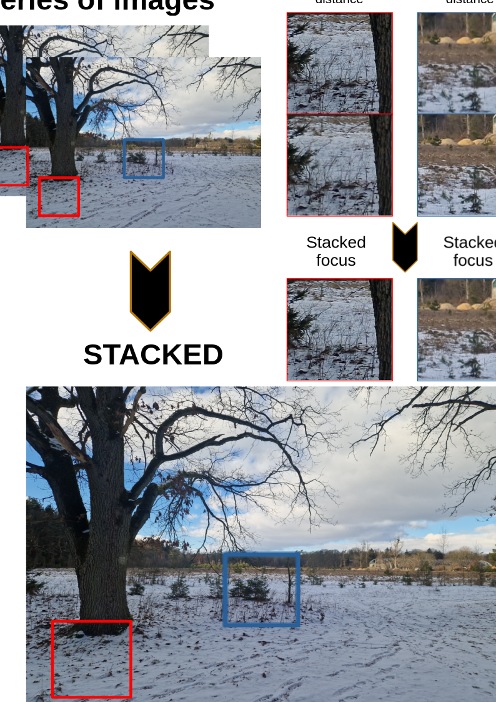

# About:  
This is my second attempt (first publicly available) at making image stacking program. Project is still in experimental stage of development so it may not always work or produce good results. There is currently a problem with visible borders between pixels from image A and B (I will try to solve that, right now setting parameter "erosion_size" to higher value can help).  
The goal is to use multiple photos of the same object/scene and create image that combines best features of each photo. Right now this program is maximizing local sharpness of each image region by using pixels from photo that has the highest variance (sharpness estimation method) of pixels in that region. Every pixel of every photo has its sharpness estimated and stacking function uses those values as well as quality of image alignment to calculate pixel's coefficients for final image. Resulting image is basically a type of weighted average of input images.  

To get image that has high sharpness for objects that are in different distances from camera user needs to make multiple photos with either moving camera closer and further from target object or change focus settings of camera. It's recommended to use tripod or to hold the camera very still when making series of photos.  
Arguably the hardest part for the program is to accurately align all images to avoid strange artifacts when blending images like average of 2 different objects, multiple copies of the same object or moving shadows etc. I am still experimenting with making image alignment more accurate but generally the biggest advantage it has over other programs is in my opinion the ability to correct for both camera movement and lens distortion (with various results ...). In other words user is not required to calibrate camera for the program to stack them.  

At least 2 images are required for stacking. This example shows that final image retains original look and has added sharpness (to regions further away from camera) from next image. Program can try to add more details from input images or retain more look of the reference image, depending on the settings.  
  


# Future development plans:  
This is mostly hobby project so there isn't any specific timeline when new features will be added. However I plan to work on the following things at some point in time:  

--make stacked images more seamless (which can be improved by matching color/brightness of input images?)  
--further improving quality of alignment  
--more robust algorithms that require specifying less parameters by user  
--performance and memory improvements  
--support more image formats  
--graphical user interface  
  
  
# How to use:  

## Installing prebuilt binary:  
Download latest executable from [releases](https://github.com/Krzysztof-Bogunia/cherrypk_pixel_stacker/releases).  

## basic usage:  
copy .jpg images to program's "input" directory  
run following command in console
```console
./cherrypk_pixel_stacker
```
resulting image will be saved in programs main directory  


## Example with multi-step processing:
---
1. Do normal alignment and stacking
```console
./cherrypk_pixel_stacker --images ./input --aligned ./aligned --settings ./settings.json
```

2. Apply additional operations on aligned images  
...extra processing...  
(possible use case is to do more alignment with chaiNNer program and rife node or apply some color corrections)  
save images to aligned2 folder

3. Load already aligned images (with some optional processing) as input and use another settings for final stacking (possibly use upscaling and 0 alignment iters this time)
```console
./cherrypk_pixel_stacker --images ./aligned2 --aligned ./aligned3 --settings ./settings2.json
```
---


## Setting input parameters  
Program loads processing parameters from **settings.json** file and currently editing it is the only way to set most of the image processing parameters.  
Launch arguments can be used to set paths of input/output folders.


### Currently you can specify the following parameters when launching the program:  
If no value is specified that default will be used.  
  
parameter | default value | description
--- | --- | ---
--images | ./input | Folder containing input images (.jpg format) that are going to be aligned and stacked
--settings | ./settings.json | File containing program settings to use when processing images
--aligned | ./aligned | Folder for outputting aligned/undistorted input images (useful for comparisons or further processing)
--masks | ./masks | Folder for outputting created masks of input images (useful for comparisons or further processing)

### Recommended image processing settings to tweak:  
Changing those parameters requires to manually modify values in **settings.json** file using text editor.  
The goal is to make the program robust enough to not require any testing and tweaking of parameters, but the results are highly depended on quality of image alignment and other factors like image resolution. I am also still experimenting with algorithms used to make the images so the following options and values may change in the future.  
Program is applying many operations with slightly randomized values, so running it twice with same settings can generate different results. If quality was bad in the first time then quick fix is to run it twice. Considering the above, if original settings don't provide good results for input images then it may be necessary to change some of the following parameters.

parameter | default value (range min; max) | description
--- | --- | ---
"base_index" | 0 (0; N)| index of base reference image. By default images are loaded in alphabetical order and first (number 0) image is considered as base image that will be "enhanced". It has big effect on final result. If first image (index 0) is mostly blurred and has very shallow depth of field then try using another image.  
"radicalChangeRatio" | 1.3 (0.0; N)| mask and prevent usage of pixels that are different at least radicalChangeRatio times compared to pixel values in base image. Values closer to 1.0 will give less changed resulting image.  
"erosion_size" | 3 (0; N)| size for expanding mask of bad pixels. Masks are used when operation that undistorts images moves pixels and some regions will not have known value or when pixels in that region are drastically different (radicalChangeRatio times) than in base image. Higher values mean that less bad pixels will be affecting values in final stacked image. Increasing it can also hide artifacts with switching between pixels from multiple images (lines, local color changes...).  
"maxIter" | 30 (0; N)| maximum number of iterations for algorithm that aligns and undistorts input images. Higher values improve quality, but decrease processing speed.  
"n_points" | 8000 (30; N)| initial number of points to detect and compare between images for aligning/undistortion. Higher values can improve quality, but sometimes less is better (quality over quantity).
"ratio" | 0.7 (0.1; 1.0)| how many points to keep for aligning/undistortion.. Smaller values filter out more points and can improve quality, but it's better to not change this parameter to much or there wil be no points to calculate alignment/undistortion. 
"checkArea" | 0.75 (0.1; 1.0)| image comparison area (from center to borders). It's used internally for calculating quality of aligned images. When input photos are very similar (made with camera on tripod) then higher values can be used to attempt more alignment, but for photos from slightly moving or shaky camera try lower values.
"splitAlignPartsVertical" | 8 (0; N)| how many times to split (vertically) image for separate alignment of each part. Higher values can result in more accurate alignment, but with more splits on each image that may be visible in final stack.  
"splitAlignPartsHorizontal" | 8 (0; N)| how many times to split (horizontally) image for separate alignment of each part. Higher values can result in more accurate alignment, but with more splits on each image that may be visible in final stack.  
"baseImgCoef" | 0.4 (0.0; 1.0)| added minimum value of base image's coefficient for stacking. Higher values give less changed resulting image.  
"coef_sharpness" | 1.5 (0.0; N)| local sharpness coefficient's weight for stacking. Higher values should give sharper image.
"coef_similarity" | 1.0 (0.0; N)| local similarity (to base image) coefficient's weight for stacking. Higher values give less changed resulting image.  
"upscale" | 1.0 (1.0; N)| if value is greater than 1.0 then final image resolution will be upscaled (upscaling input images and stacking them). Higher values increase details, but memory usage for processing and storage is also increased.


# Supported platforms:  
Program may work on other linux distributions, but it has been tested just on the following:  

-Ubuntu 22.04  


# External dependencies:  
This project relies on external software components for some functionality.  
[libInterpolate](https://github.com/CD3/libInterpolate.git) with MIT License. Used for interpolating parameters in image calibration and alignment functions  
[jsoncpp](https://github.com/open-source-parsers/jsoncpp.git) with MIT license. Used for loading and saving data in json format  
[opencv](https://github.com/opencv/opencv) with Apache License 2.0. Used for many image processing operations including loading/saving images, alignment, calibration and undistortion  

If you are building project from source then you are also required to have Boost and Eigen packages installed because they are required by some dependencies.  
OpenMP is optional dependency that provides multithreading support.  


# Building from source:  
By default project is configured to compile program with static versions of dependencies (user of the program doesn't need to install it).  

On Ubuntu the build dependencies can be installed by using commands:  
```console
sudo apt install build-essential cmake git libboost-all-dev libeigen3-dev
```

Download the project to current directory:  
```console
git clone https://github.com/Krzysztof-Bogunia/cherrypk_pixel_stacker.git
cd cherrypk_pixel_stacker
```

To build project run commands:  
```console
cmake -DCMAKE_BUILD_TYPE=Release -S . -B ./build
cmake --build ./build --config Release
```
The compiled program will be available from path ./build/bin/cherrypk_pixel_stacker  


